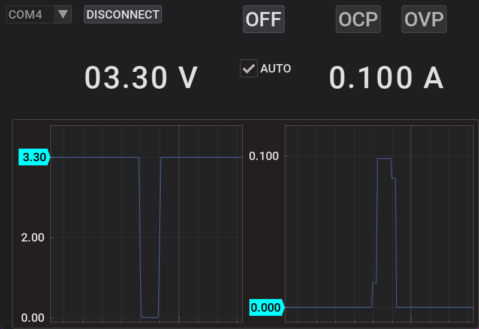

# koradGui

kordGui is opinionated and not very creatively named GUI app for controlling Korad bench power supplies.

It should be compatible with all KA3xxxP, but has been tested only with KA3005P.

> [!CAUTION]
> This program directly affects the circuit connected to the controlled power supply and can cause damage.
>** Use at your own risk.**




# Details

GUI is built with Dear ImGui via imgui_bundle bindings.

Distribution builds are created with cx-Freeze so they are not a single file.
Adding Pyinstaller or other self-extraction solution should be trivial.

Running the distribution build:

```bash
python setup.py build
```

