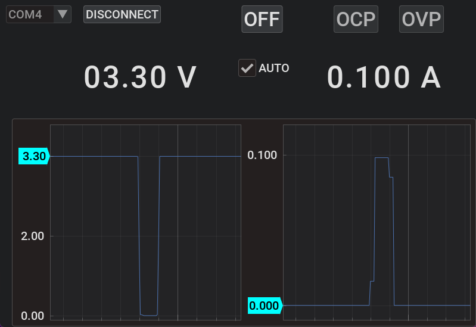

# koradGui

kordGui is opinionated and not very creatively named GUI app for controlling Korad bench power supplies.

It should be compatible with all KA3xxxP, but has been tested only with KA3005P.

> [!CAUTION]
> This program directly affects the circuit connected to the controlled power supply and can cause damage.
>** Use at your own risk.**




# Details

GUI is built with Dear ImGui via imgui_bundle bindings.

Distribution is a **single-file AppImage** built with cx-Freeze
(`bdist_appimage`). To build locally:

```bash
uv sync
uv run python setup.py bdist_appimage   # -> dist/koradgui-*.AppImage
uv run python setup.py build_exe        # -> build/exe.*/koradGui (directory build)
```

A GitHub Actions workflow (`.github/workflows/build.yml`) builds the AppImage
in a manylinux_2_28 container (works on any distro with glibc >= 2.28), smoke
tests it headlessly and attaches it to `v*` tag releases.

